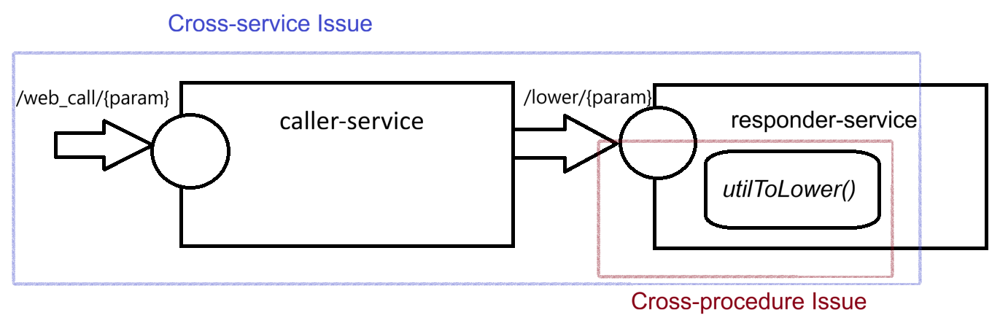

# A Distributed System with Cross-service Vulnerabilities
## A sample project used for demoing [API Guard](https://github.com/ahmedyarub/api_guard_demo)

This demo project consists of two microservices:
**responder-service** exposes the endpoint http://localhost:8081/responder/lower/{param}. This endpoint has an XSS vulnerability due the fact that the path variable _param_ is returned as-as (after converting it to lower letter), which means that a malicious user can directly write to the response.

This category of errors is easily detected by static-analysers that can do cross-procedure analysis, such as CodeQL.

Meanwhile, the microservice **caller-service** exposes the endpoint http://localhost:8080/web_call/{param}. This endpoint calls responder-service, which means that it is also vulnerable to XSS attacks since the response of responder-service, vulnerable to XSS attacks, is returned as is.
